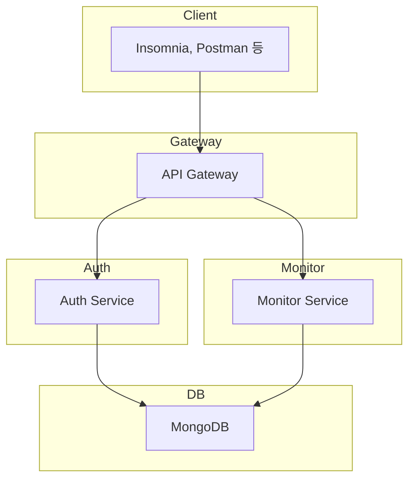

# ✅ 시스템 설계

## 🎯 목표

* 전체 서비스 구조 정의
* 서비스별 책임 및 통신 방식 설계

---

## 🧱 시스템 아키텍처 구성

### 📌 전체 구조 (NestJS + MSA)

---

## 📦 서비스별 책임 정리

| 서비스         | 역할                                               |
| ----------- | ------------------------------------------------ |
| **Gateway** | 모든 API 요청의 진입점 JWT 인증/검증 역할(Role) 확인 및 라우팅 |
| **Auth**    | 유저 회원가입, 로그인 JWT 발급 유저 역할(Role) 저장         |
| **Monitor** | 유저 행동 로그 저장 이상행동 탐지 경고 생성 및 이력 조회          |

---

## 🛠️ 서비스 간 통신 방식

| 통신                | 방식  | 도구                                    |
| ----------------- | --- | ------------------------------------- |
| Gateway → Auth    | TCP | `ClientProxy`, `nestjs/microservices` |
| Gateway → Monitor | TCP | `ClientProxy`, `nestjs/microservices` |

---

## 🔐 인증/인가 흐름

1. 유저는 `POST /auth/login`을 호출
2. `Auth` 서비스에서 JWT 발급
3. 이후 모든 요청은 `Authorization: Bearer <token>` 헤더 포함
4. Gateway에서 JWT 유효성 검증 + Role 확인 후 라우팅

---

## 🧪 예시 흐름: 이상행동 감지

1. 유저가 `/logs` API 호출하여 행동 기록 전송
2. Gateway → Monitor로 전달
3. Monitor는 로그를 저장하고 조건을 검사
4. 이상행동이면 `warnings` 컬렉션에 경고 생성

